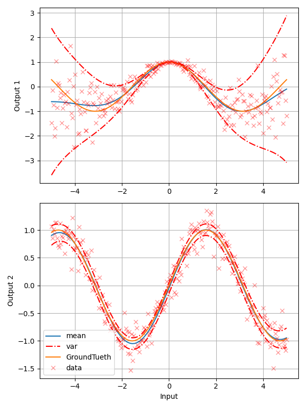

### JY's machine learning and control workspace, 
The **SARCOS** dataset, which is intended for a regression problem of robot inverse dynamics, is regarded as the benchmark of ML.  
The gym **pendulum** environment is chosen to be the benchmark of control project.
  
  
Update: 31.11.2022, finished the kernel classes enabling the kernel operations (add, multiply and exponent). A Gaussian process regressor has been implemented to validate the performance of compounding kernel on an artificial dataset with state depend noise.  

Finished functions:
#### Machine learning  
| Approach      | MSE           |
| ------------- |:-------------:|
| Ridge + feature      | 2.111 |
| MLP      | 1.469      |
| ... |       |
#### Control  
| Approach        | Reward Mean (50 runs) | Reward Variance|
| ------------- |:-------------:|:-------------:|
| iLQR2       | -305.57 |   38239.82    |
| SAC 1  | -144.04 | 8377.89 |
| FLQR3  | - | - |
| DMD-MPC4  | -164.93 | 10945.07 |
| RK4-MPC5  | -142.25 | 9367.64 |
| ...| | |

Notes:  
1. In SAC(soft actor-critic) the reinforcement learning package stablebaseline3 was used to compare with various control strategies. The training ran for 50k timesteps, to a convergence of the epi reward.  
2. The cost matrices in iLQR are hard to tune by hand, and the torque constraints can't be taken into account. Therefore, its performance is just ok, but no problem to swing up and stabilize.  
3. Finite horizon LQR based on Dynamic mode decomposition(DMD). Not working, the tracking objective function is hard to define.  
4. MPC with the model learned through DMD. Very naive implementation, the symbolic feature expansion limits the speed of solution. There are better ways to include the nonlinear objective function into koopman feature.  
5. MPC with Runge Kutta 4th order simulation on ground-truth ode. This approach can't let the gym rendering in real time.  
